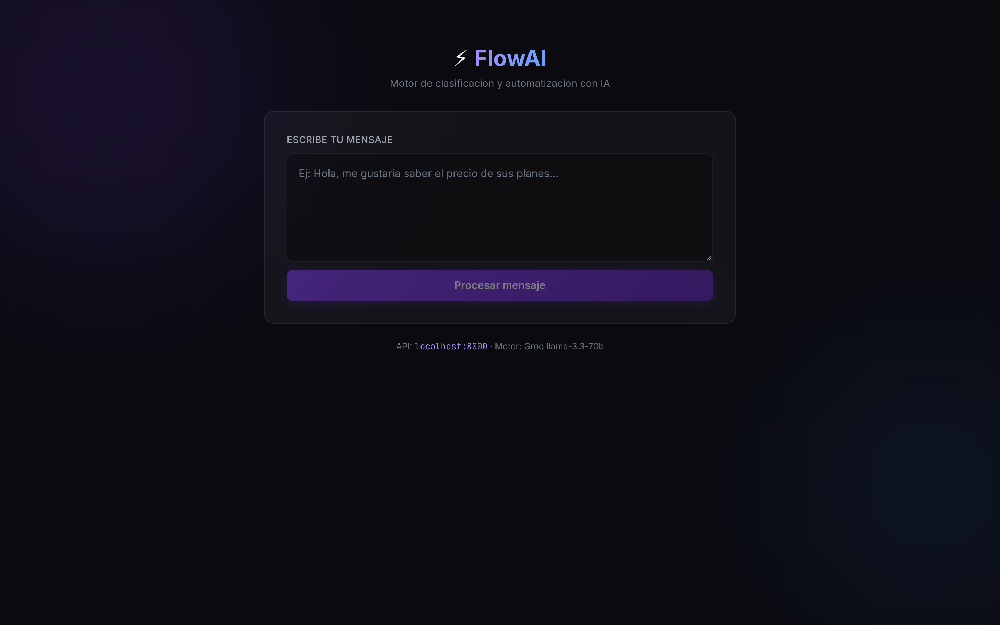
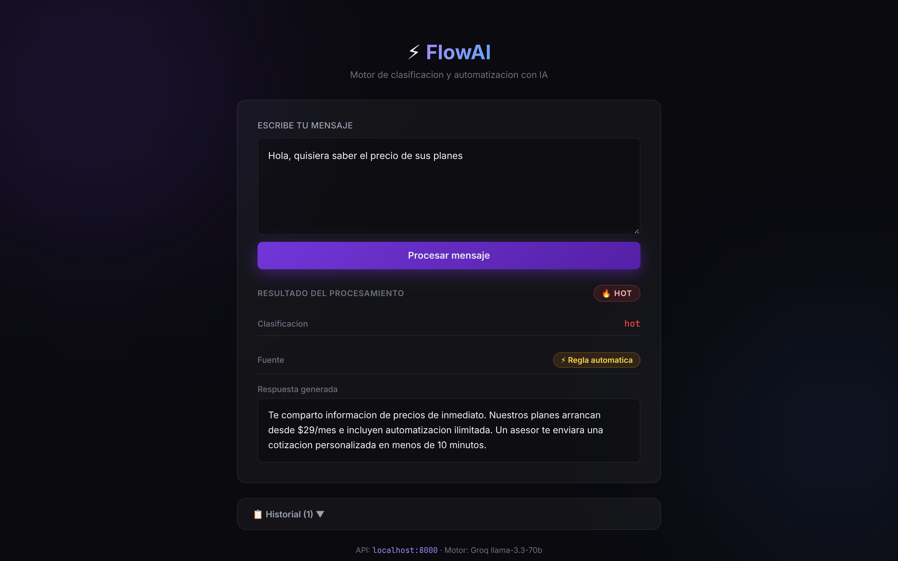
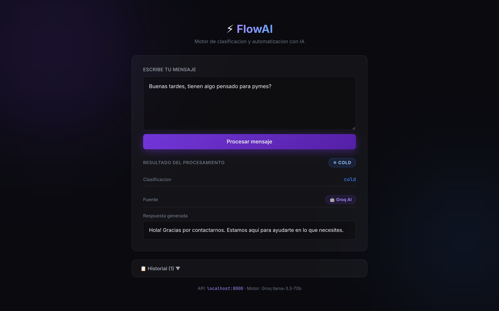
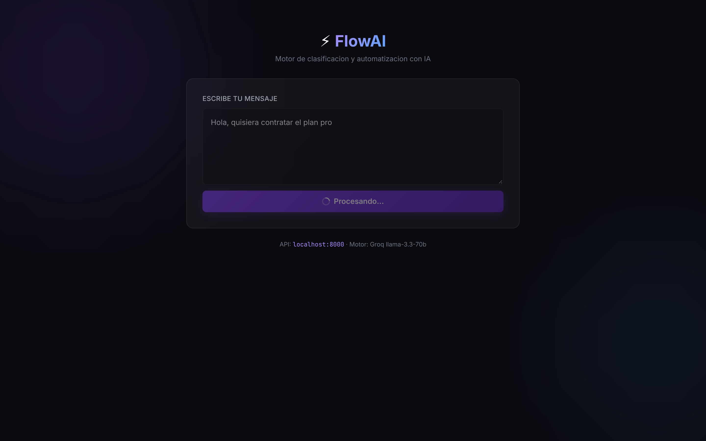
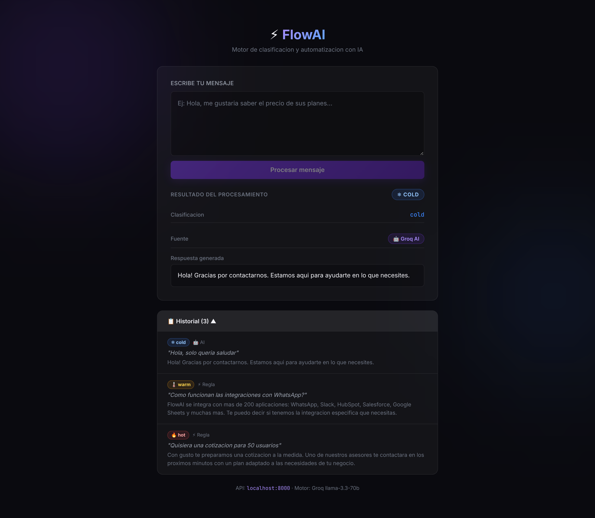
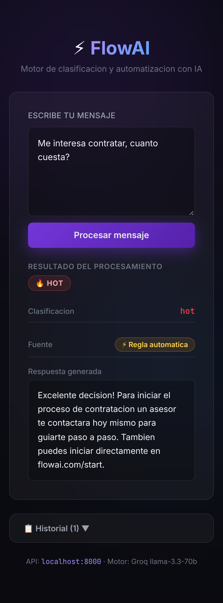

# FlowAI

### AI-Powered Customer Message Automation Platform

FlowAI is a full-stack application that combines deterministic business rules with Large Language Models (LLMs) to automatically classify customer messages and generate intelligent responses in real time.

Instead of relying exclusively on AI, FlowAI first evaluates configurable business rules. Only messages that cannot be resolved deterministically are forwarded to an LLM, reducing latency and inference costs while maintaining natural conversations.

The project demonstrates practical AI integration, backend architecture and automation patterns commonly found in CRM, customer support and sales platforms.

---

# 📸 Preview

| Dashboard | Clasificación HOT (regla automática) | Clasificación COLD (IA) |
|:---:|:---:|:---:|
|  |  |  |

| Estado de procesamiento | Historial de conversaciones | Vista móvil |
|:---:|:---:|:---:|
|  |  |  |

Más capturas en [`screenshots/`](screenshots/):

- `02-escribiendo.png` — entrada del mensaje del cliente
- `04-warm.png` — lead WARM detectado por regla (`demo`)
- `05-cold.png` — mensaje resuelto por el motor de IA (fallback de palabras clave sin `GROQ_API_KEY`)

---

# 🚀 Tech Stack

### Backend

- Python
- FastAPI
- Pydantic
- PostgreSQL (planned)

### Frontend

- React
- TypeScript
- Vite

### AI

- Groq API
- LLaMA 3.3
- Prompt Engineering

### DevOps

- Git
- Docker
- GitHub Actions

---

# 💡 Why I Built This

Many companies receive hundreds of customer messages every day.

Some questions are repetitive and can be answered instantly, while others require contextual reasoning.

Instead of sending every request directly to an LLM, FlowAI combines deterministic business logic with artificial intelligence to create a faster and more efficient automation pipeline.

This hybrid approach reduces costs, improves response time and demonstrates how modern AI products are commonly designed.

---

# ✨ Key Features

- AI-powered message classification
- Hybrid Rule Engine + LLM architecture
- Automatic response generation
- Keyword-based fallback logic
- Structured API responses
- Modular backend architecture
- Interactive React dashboard
- REST API with FastAPI

---

# 🧠 AI Workflow

Every incoming message follows the same decision pipeline.

```
Incoming Message
        │
        ▼
 Rule Engine
        │
 ┌──────┴────────┐
 │               │
Match         No Match
 │               │
 ▼               ▼
Return      Groq LLM
Response         │
                 ▼
          Intent Classification
                 │
                 ▼
       Response Generation
                 │
                 ▼
      Pydantic Validation
                 │
                 ▼
        Return Response
```

If the AI service becomes unavailable, the system automatically falls back to deterministic keyword classification.

---

# 🏗️ Architecture

The project is divided into independent layers following separation of concerns.

```
React Frontend
       │
       ▼
 FastAPI API
       │
       ▼
Message Service
       │
 ┌─────┴──────────┐
 │                │
 ▼                ▼
Rule Engine    AI Service
                  │
                  ▼
              Groq API
```

Each service is isolated, making it easy to replace the AI provider or extend the business logic.

---

# 📂 Project Structure

```text
FlowAI/

├── backend/
│
│   ├── app/
│   │
│   ├── config/
│   ├── models/
│   ├── routes/
│   ├── schemas/
│   ├── services/
│   └── main.py
│
├── frontend/
│
│   ├── src/
│   ├── components/
│   └── services/
│
└── README.md
```

---

# ⚙️ How It Works

The application processes every message through four stages.

### 1. Rule Evaluation

The Rule Engine searches predefined business rules.

If a rule matches, the workflow finishes immediately.

---

### 2. AI Classification

If no rule applies, the message is sent to Groq.

The LLM determines:

- Customer intent
- Classification
- Natural language response

---

### 3. Validation

Every AI response is validated through Pydantic before reaching the frontend.

---

### 4. Storage

The processed message is stored together with:

- Original message
- Classification
- Generated response
- AI / Rule indicator
- Timestamp

---

# 🧪 Example Request

```http
POST /messages
```

```json
{
    "content":"I'd like to know your pricing."
}
```

---

# Example Response

```json
{
    "classification":"hot",
    "response":"Our pricing starts at $29/month.",
    "rule_matched":true
}
```

---

# 🛠️ Getting Started

## Backend

```bash
cd backend

pip install -r requirements.txt

uvicorn app.main:app --reload
```

---

## Frontend

```bash
cd frontend

npm install

npm run dev
```

---

## Environment Variables

```env
GROQ_API_KEY=your_api_key
```

---

# ☁️ Deploy en Netlify

El frontend ya trae [`netlify.toml`](netlify.toml) listo para Netlify. Netlify aloja el frontend (sitio estático); el backend FastAPI vive aparte.

### Opción A — Netlify Drop (la más rápida)

```bash
cd frontend
npm install
npm run build          # genera frontend/dist
```

Luego arrastra la carpeta `frontend/dist` a https://app.netlify.com/drop.

### Opción B — Conectar el repo a Netlify

1. En Netlify: *Add new site → Import an existing project → GitHub* y elige este repo.
2. Netlify lee `netlify.toml` (base `frontend`, publish `dist`) automáticamente.

### Conectar el backend

El sitio llama rutas relativas (`/messages`), así que tienes dos formas de apuntarlo a tu backend:

1. **Variable de build (recomendada):** en *Site configuration → Environment variables* define `VITE_API_URL=https://tu-backend.onrender.com` y redespliega. Además, en el backend define `CORS_ORIGINS=https://tu-sitio.netlify.app` (ver `backend/.env.example`).
2. **Proxy de Netlify:** descomenta los bloques `[[redirects]]` de `netlify.toml` y reemplaza `https://TU-BACKEND` por tu URL; así las llamadas quedan en el mismo origen y no necesitas tocar CORS.

> Para desplegar el backend gratis: Render / Railway / Fly.io sirven el `uvicorn app.main:app` tal cual.

---

# 🎯 Engineering Highlights

This project demonstrates:

- AI Integration
- Prompt Engineering
- REST API Design
- FastAPI
- Backend Architecture
- Service Layer Pattern
- Separation of Concerns
- Rule Engines
- Hybrid AI Systems
- Pydantic Validation
- React Integration

---

# 🔮 Future Improvements

- PostgreSQL persistence
- JWT Authentication
- Rule Management Dashboard
- Streaming Responses
- Analytics Dashboard
- Webhooks
- Docker Compose
- CI/CD Pipeline

---

# 📄 License

This project is intended for educational and portfolio purposes.

Feel free to explore the architecture and adapt ideas for your own projects.
